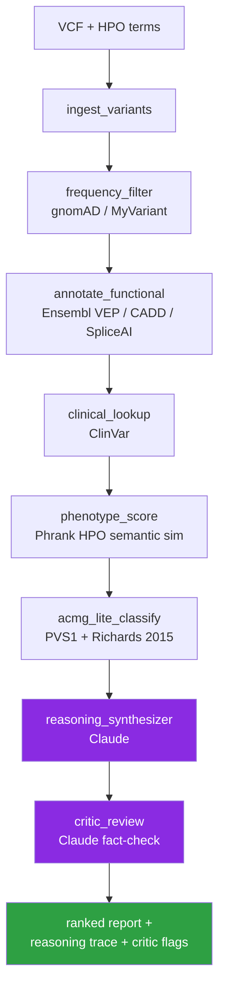

# agentic-genomics

> **Agentic AI for genomics — with reasoning traces you can audit.** An LLM-plus-tools pattern that makes variant interpretation explainable, not opaque.

[](./LICENSE)
[](https://www.python.org/downloads/)
[](https://langchain-ai.github.io/langgraph/)
[](#roadmap)

Genomics workflows are long, judgment-heavy, and scattered across a dozen databases. LLMs with the right **tools + structured reasoning** can act as a research copilot — drafting interpretations, explaining their evidence, and letting the human focus on the decisions that actually matter.

This repo is a growing collection of such agents. The flagship agent is **GenomicsCopilot**, a variant-interpretation assistant.

> ⚠️ **Research demonstration only. Not for clinical use. Not a medical device.** The ACMG implementation is a transparent *lite* subset — not certified, not complete, and not a substitute for a clinical variant scientist. See [`LIMITATIONS.md`](./LIMITATIONS.md) and [`DISCLAIMER.md`](./DISCLAIMER.md) for the full accounting of what this system does and does not do.

---

## Why agentic AI for genomics?

A traditional variant annotation pipeline is a DAG: VCF → VEP → ClinVar join → filter → report. It runs fast and is reproducible, but it can't do what a clinical geneticist actually does mentally:

- *"The patient has seizures and microcephaly — which of these 42 rare variants are in HPO-relevant genes?"*
- *"This missense has conflicting ClinVar entries and a moderate CADD score — should I escalate it?"*
- *"SpliceAI predicts a donor loss, but gnomAD shows it in 3 homozygotes — downgrade."*

These are **reasoning steps** over heterogeneous evidence. Agentic LLMs are a natural fit: they can call the right tool at the right time, keep state across steps, and — crucially — **show their reasoning** so a human can audit it.

Read more: [`docs/why-agentic.md`](./docs/why-agentic.md).

---

## Flagship agent: `GenomicsCopilot` — variant interpretation

**Input:** a VCF file + a list of [HPO](https://hpo.jax.org/) phenotype terms for the proband.
**Output:** a ranked, *explainable* list of candidate variants with ACMG-lite evidence chains and a plain-English research summary, **plus a critic-reviewed check** that flags any LLM claims not supported by the underlying evidence JSON.

### Architecture



Each node is a LangGraph step with typed state. LLMs are used where judgment is needed (phenotype-weighted ranking, narrative synthesis, fact-checking) — not where deterministic computation suffices (frequency filtering, score fetching, rule application). This is a deliberate design principle: **use agents for reasoning, not for arithmetic.**

### Example output (excerpt)

```
Variant: chr2:166179712 T>C  (SCN1A: p.Met145Thr)
Rank: 1  |  Confidence: HIGH

Evidence chain:
  ✓ Absent in gnomAD v4 (PM2_Supporting)
  ✓ ClinVar: Likely Pathogenic, 3 submitters, no conflicts (PP5)
  ✓ SpliceAI donor loss Δ = 0.81 (PP3)
  ✓ SCN1A linked to HPO:0001250 "Seizure" (patient phenotype match)
  ✓ Missense, dominant LoF mechanism well-established for SCN1A (PS1_moderate)

ACMG call: Likely Pathogenic  (2× Moderate + 2× Supporting)

Reasoning: This variant is absent from large population databases and falls
in SCN1A, a gene with a well-established haploinsufficiency mechanism for
Dravet syndrome. The patient's seizure phenotype matches known SCN1A-related
disorders (HPO:0001250). SpliceAI additionally predicts a donor-site disruption
at this position, strengthening the functional case...
```

This is the **reasoning trace** — the core differentiator over purely rule-based tools like [InterVar](https://wintervar.wglab.org/), and the core trust-building move over opaque one-shot LLM prompts.

> **How this compares to prior art.** Tools like [InterVar](https://wintervar.wglab.org/), [CardioClassifier](https://www.cardioclassifier.org/), [PathoMAN](https://pathoman.mskcc.org/), and commercial platforms (Franklin, Fabric GEM) implement the full 28 ACMG/AMP criteria with expert-reviewed refinements — far beyond what this repo does. LLM-based efforts like [GeneGPT](https://github.com/ncbi-nlp/GeneGPT) (NCBI, 2024) and [VarChat](https://github.com/crs4/VarChat) show the tool-calling pattern is viable for genomics. `agentic-genomics` sits in a different niche: a small, readable, self-critiquing reference implementation for the *agentic* pattern — not a production interpreter. See [`LIMITATIONS.md`](./LIMITATIONS.md) for what's missing.

---

## Quick start

```bash
# 1. Clone and install
git clone https://github.com/ankurgenomics/agentic-genomics.git
cd agentic-genomics
python -m venv .venv && source .venv/bin/activate
pip install -e ".[demo]"

# 2. Set your API key
cp .env.example .env
# edit .env and set ANTHROPIC_API_KEY

# 3. Run the demo on sample proband data
agentic-genomics interpret \
    --vcf data/samples/proband_demo.vcf \
    --hpo HP:0001250,HP:0001263 \
    --out reports/proband_demo.md
```

Or explore interactively:

```bash
jupyter lab notebooks/01_variant_interpreter_demo.ipynb
# or
streamlit run apps/streamlit_demo.py
```

---

## Repository layout

```
agentic-genomics/
├── src/agentic_genomics/
│   ├── agents/variant_interpreter/   # GenomicsCopilot (flagship)
│   │   ├── graph.py                  # LangGraph state machine
│   │   ├── state.py                  # Typed agent state
│   │   ├── nodes.py                  # Reasoning nodes
│   │   └── tools/                    # Bio-database tools
│   ├── core/                         # LLM wrapper, cache, logging
│   └── cli/                          # `agentic-genomics` command
├── notebooks/                        # Interactive demos
├── apps/streamlit_demo.py            # Web demo
├── data/samples/                     # Small curated public VCFs
├── docs/                             # Architecture, why-agentic, roadmap
└── tests/
```

---

## Roadmap

GenomicsCopilot is the first agent. The repo is structured to host more:

| Agent | Status | What it does |
|---|---|---|
| **GenomicsCopilot** (variant interpretation) | 🟢 MVP | VCF + phenotype → ranked explainable variants, with a critic-reviewed report |
| **NextflowAgent** | 🔵 Planned | Natural language → production Nextflow pipelines, self-healing |
| **scRNA-Agent** | 🔵 Planned | `.h5ad` + question → Scanpy notebook + cell-type-aware answer |
| **LitMiner** | 🔵 Planned | Gene/variant → PubMed + bioRxiv synthesis → testable hypotheses |

See [`docs/roadmap.md`](./docs/roadmap.md) for detailed designs.

---

## Design principles

1. **Agents reason, pipelines compute.** LLMs are used where judgment is required, never where a deterministic function would do.
2. **Every decision is traceable.** Every agent run emits a structured reasoning trace you can audit and version.
3. **Public data, public APIs.** Nothing in this repo requires proprietary data access.
4. **Minimal, not sprawling.** Each agent has ≤6 tools, each tool does one thing well.
5. **Research-grade, not clinical-grade.** Always.

---

## Author

**Ankur Sharma** — AI · ML · Data Science · Bioinformatics · AWS — [@ankurgenomics](https://github.com/ankurgenomics)

Portfolio site (lives in this repo): [`docs/site/`](./docs/site/) — deployable as GitHub Pages.

If you're working at the intersection of agentic AI and genomics, I'd love to hear from you. Open an issue or reach out.

---

## License

MIT — see [`LICENSE`](./LICENSE).
