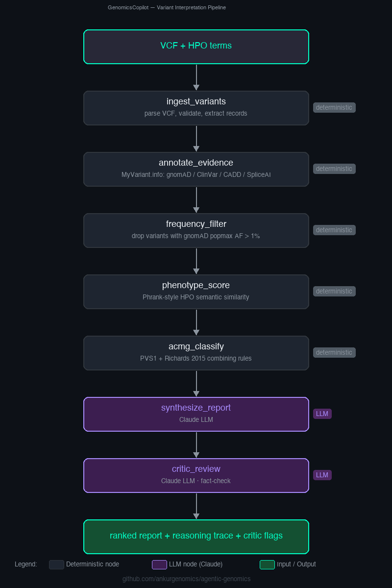
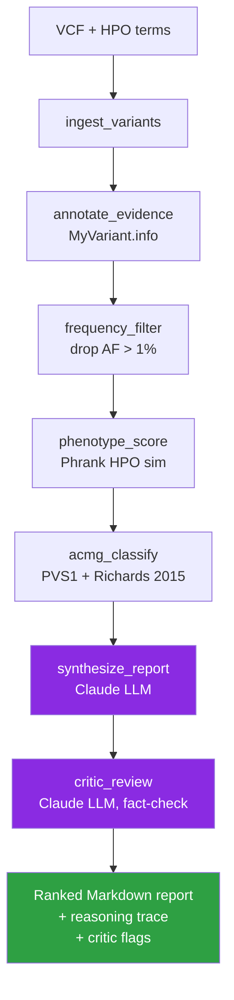

# Architecture

This document describes how `agentic-genomics` is organised and why.

## High-level

```
agentic-genomics/
├── src/agentic_genomics/
│   ├── core/                  # Provider-agnostic LLM, cache, logging
│   ├── agents/                # One subpackage per agent
│   │   └── variant_interpreter/
│   │       ├── graph.py       # LangGraph state machine
│   │       ├── state.py       # Typed agent state (Pydantic)
│   │       ├── nodes.py       # Reasoning nodes (deterministic + LLM)
│   │       ├── prompts/       # Versioned system + user prompts
│   │       └── tools/         # Bio-database clients (MyVariant, HPO, ACMG, VCF)
│   └── cli/                   # `agentic-genomics` Typer app
├── apps/streamlit_demo.py     # Interactive web demo
├── notebooks/                 # Reproducible walkthroughs
├── data/samples/              # Small, curated, public demo data
├── docs/                      # Design docs
└── tests/                     # Unit + integration tests
```

## The `variant_interpreter` graph



<details>
<summary>Mermaid source (click to expand)</summary>



</details>

**Orchestration is deterministic**; only `synthesize_report` and `critic_review` call an LLM. The critic node is the one genuinely agentic loop: it sees the same evidence JSON the synthesiser saw, plus the synthesiser's draft, and returns structured flags for any unsupported claims. This is a deliberate, conservative take on the agent pattern (see [`why-agentic.md`](./why-agentic.md#use-llms-for-reasoning-not-arithmetic) and [`../LIMITATIONS.md`](../LIMITATIONS.md#5-what-the-agent-is-and-is-not)).

## State contract

All nodes read/write a single Pydantic model, `VariantInterpreterState`, that carries:

- **Inputs** — `vcf_path`, `hpo_terms`, `max_variants`
- **Derived** — `variants: list[AnnotatedVariant]` accumulating evidence through the graph
- **Audit** — `reasoning_trace: list[dict]` appended by every node
- **Output** — `report_markdown`

Because state is typed, each node's contract is self-documenting and trivially testable in isolation.

## Tools

| Tool                            | What it wraps                  | Returns                                 |
| ------------------------------- | ------------------------------ | --------------------------------------- |
| `tools/vcf_parser.py`           | pysam on a VCF file            | `list[Variant]`                         |
| `tools/myvariant.py`            | MyVariant.info REST API        | `PopulationFrequency`, `FunctionalScores` (incl. gnomAD pLI/LOEUF), `ClinicalEvidence` |
| `tools/hpo.py`                  | JAX HPO Toolkit API + IC-weighted LCA over the HPO DAG | `PhenotypeMatch` with Phrank-style score |
| `tools/acmg_lite.py`            | pure-Python rule engine; 9/28 criteria + Richards 2015 combining rules | `ACMGAssessment`                        |

Every network-bound tool is disk-cached (`core/cache.py`) so reruns and tests don't thrash upstream services.

## Why no LangChain `Tool` / agent-executor?

For the MVP, a hand-wired LangGraph state machine is *clearer* than a tool-calling agent:

- We know the exact order of operations for variant interpretation.
- We don't want the LLM to skip frequency filtering or ACMG classification.
- Latency is predictable (one LLM call instead of many).

A future `deep_variant_research` agent (explore literature, suggest next experiments) will use tool-calling because the control flow is genuinely non-deterministic there.

## LLM layer

`core/llm.py` exposes a single `get_llm()` factory that returns a LangChain-compatible chat model. The default is Claude (`claude-sonnet-4-5`) because its long-context reasoning handles tabular evidence chains well. Swapping in OpenAI or a local model is a one-line change; no agent code changes.

## Caching strategy

- `core/cache.py` — tiny JSON-on-disk cache keyed by `(namespace, key)`.
- Default TTL: one week (configurable).
- Cache lives in `.agentic_genomics_cache/` (git-ignored).
- Keys are SHA-1 hashes; values are JSON.

This keeps the demo snappy on re-runs and reduces API load.

## Extensibility: adding a new agent

The monorepo pattern is:

```
src/agentic_genomics/agents/<new_agent>/
├── __init__.py
├── graph.py       # build_<new_agent>() returns a compiled LangGraph
├── state.py       # Pydantic state contract
├── nodes.py       # one function per graph node
├── prompts/       # versioned prompts
└── tools/         # domain-specific tools
```

Then expose a CLI subcommand in `src/agentic_genomics/cli/main.py` and add a walkthrough notebook under `notebooks/`.

Planned agents are tracked in [`roadmap.md`](./roadmap.md).
